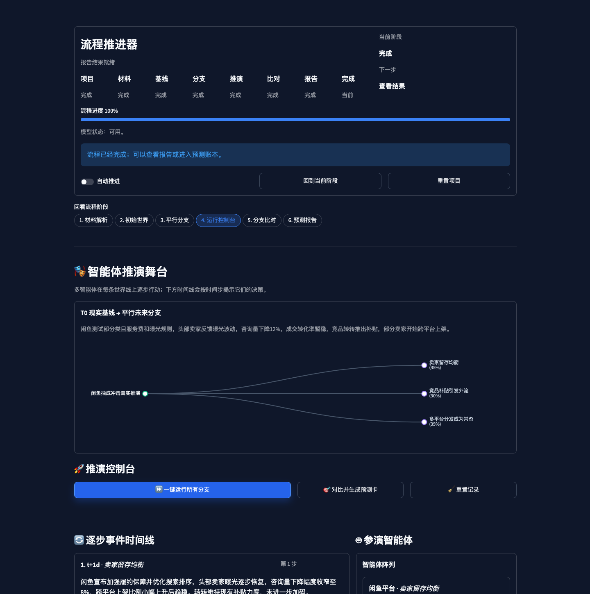

# 平行世界推演台 (Divergent Worlds)

中文 | [English](README.en.md)

> 把一个现实问题分叉成多个平行未来，给每个未来写下**可证伪的预注册预测**，再用现实反馈追踪——我们正在走向哪一个世界。

平行世界推演台不是又一个「AI 预测引擎」，也不是一次性的 AI 报告生成器。它的立场很简单：**我们不预测「唯一的未来」，而是生成多个可能的未来，把每一个都变得具体、可证伪，然后让现实来裁决。**

它做三件事：

1. **分叉（Branch）**：从你的背景材料构建当前世界状态，自动发散出 3–7 个互斥的反事实分支（「如果……会怎样」）。
2. **预注册（Pre-register）**：把每个分支落成一张可证伪的预测卡——具体预测、概率、验证窗口、支持 / 失败 / 无信息标准、最小观察动作、止损条件。
3. **校准（Calibrate）**：用本地预测账本跟踪现实反馈，给每张卡打分（Brier），告诉你哪个分支正在兑现、以及这套生成器到底值不值得信。

> 它给你的不是又一份 AI 报告，而是**几张能被现实打分的预测卡**。

本版本完整实现了 12 项功能需求 (FR-1 ~ FR-12)，加固了推演引擎，并提供了丰富的数据可视化及断点续传特性。



---

## 🌟 1.0 核心特性

- **FR-1 & FR-8 ~ 12: 极速创建与预载场景模板**：内置包括“电商平台经营”、“政策宏观反事实”、“开源项目趋势”、“品牌舆论发酵”等多个典型场景的预填充模板，支持一键载入参数。
- **FR-2 & FR-3: 多格式材料解析与世界建模**：支持解析 TXT、MD、Markdown、CSV、PDF 以及 JSON 文件。能自动从混乱材料中抽取事实、变量、行动者和不确定性，组装为 T=0 初始世界模型。
- **FR-4: 分支多样性量化与自动分类**：支持从初始世界自动发散 3 到 7 个平行世界分支，自动评估分支的核心假设和变量的文本/变化多样性得分，自动分配 archetype 世界类型。
- **FR-6: 自动化数据分叉与变动检测**：上传 CSV 数值序列时，系统将自动使用 rolling mean 相对均值偏离算法与 z-score 统计学异常检测，扫描提取出显著的数据分叉、剧变与异常点，辅助发散。
- **FR-7 & FR-8: 智能体（Agent）推演与断点恢复**：每个世界线实例化 5-10 个带有背景及信念更新机制的 Agent。推演过程支持实时存盘。一旦遭遇中断，可优雅地从最后一个已完成的分支和时间步开始断点恢复运行，亦支持一键重置。
- **FR-9: 多维世界与智能体决策比对**：提供关键变量时序演化折线图（基于 ECharts）和各分支智能体决策行为横向比对面板，直观展现不同世界的差异。
- **FR-11: 预测校准账本 (Forecast Ledger)**：使用本地 SQLite 数据库跨案例记录每一张预测卡片的生命周期，支持给预测打分，并实时绘制预测状态饼图、不同场景精度条形图和 Brier 预测得分趋势折线图。
- **FR-12: Markdown + JSON 双格式报告下载**：一键生成长篇报告（事实/假设/推演/推理等），提供 Markdown 与完全结构化的 JSON 报告数据包下载。

---

## 📂 项目结构

```text
app.py                    Streamlit 入口
engine/                   核心引擎模块
  ├── schemas.py          Pydantic 数据模型定义
  ├── ingest.py           材料解析与分叉检测 (FR-2, FR-6)
  ├── world_builder.py    初始世界状态构造 (FR-3)
  ├── fork_generator.py   分支生成、多样性校验与类型标注 (FR-4)
  ├── world_profiler.py   世界敏感度参数画像 (FR-5)
  ├── actor_generator.py  智能体实例化生成 (FR-7)
  ├── simulation_runner.py  多时间步模拟与断点恢复引擎 (FR-8)
  ├── divergence_analyzer.py  世界分歧提炼与分支排序 (FR-9)
  ├── forecast_card.py    可验证预测卡片生成 (FR-10)
  ├── forecast_ledger.py  SQLite 预测账本与 Brier 计算 (FR-11)
  └── report_generator.py Markdown 与 JSON 报告生成 (FR-12)
pages/                    Streamlit 页面，对应五幕推演工作流
prompts/                  9 个结构化模型提示词模板
prompts/en/               9 个英文结构化模型提示词模板
tests/                    自动化单元与集成测试包
```

---

## 🛠️ 快速启动

### 1. 搭建运行环境

推演台采用 `python3` 及标准虚拟环境运行：

```bash
# 1. 创建虚拟环境
python3 -m venv .venv
# 2. 激活并安装依赖
source .venv/bin/activate  # macOS / Linux
.venv/bin/python -m pip install --upgrade pip
.venv/bin/python -m pip install -r requirements.txt
# 3. 复制配置文件
cp .env.example .env
```

然后打开并编辑本地 `.env` 文件。

### 2. 配置大模型底座

在 `.env` 中指定您的 OpenAI 兼容接口参数：

```dotenv
LLM_LIVE_ENABLED=true
LLM_BASE_URL=https://api.openai.com/v1   # 或其他服务商网关
LLM_API_KEY=your_real_api_key_here
LLM_MODEL=gpt-4o-mini
APP_LANGUAGE=zh
LLM_OUTPUT_LANGUAGE=zh
DATA_DIR=data
```

### 3. 运行本地推演台

```bash
DATA_DIR="$(pwd)/data" .venv/bin/python -m streamlit run app.py \
  --server.headless true \
  --server.port 8507 \
  --browser.gatherUsageStats false
```

打开浏览器访问 `http://127.0.0.1:8507` 即可开始使用。在首页「新建自定义项目」中填写问题、场景与分支即可开始一条推演。

---

## 🧪 自动化测试验证

全量测试（含向导流程、预测卡渲染、台账 UI 的 AppTest 覆盖）确保引擎核心模型数据校验不失效、JSON 序列化稳定及断点续连机制无 BUG：

```bash
# 运行全量测试
.venv/bin/python -m pytest tests/ -v --tb=short -p no:cacheprovider

# 运行代码覆盖率统计
.venv/bin/python -m pytest tests/ --cov=engine --cov=pages --cov-report=term-missing
```

---

## 🔒 隐私与安全性规范

Divergent Worlds 遵循本地优先原则，您的所有上传文件、中间处理状态和最终报告皆完全保存在本地 `DATA_DIR` 中。当您运行需要大模型（LLM）参与的引擎服务时，系统会明确提示您数据可能需要发送给配置的第三方模型 API，敬请知悉并在处理高度敏感及客户保密数据时注意模型合规性。
